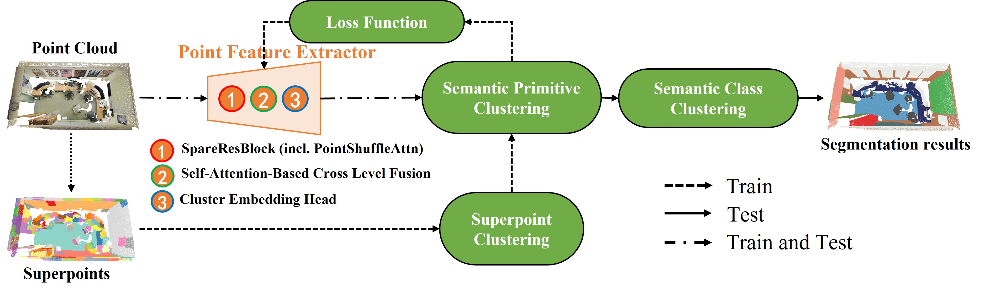
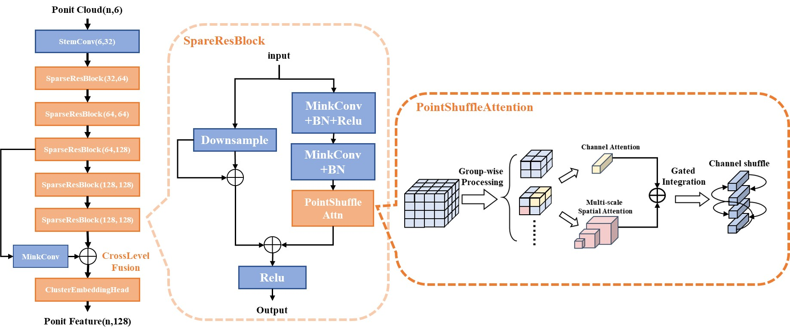
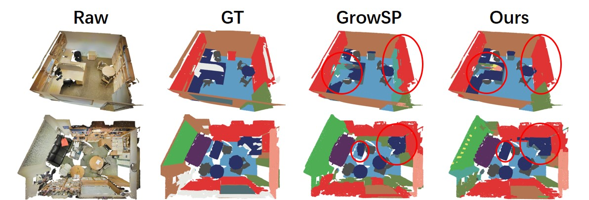
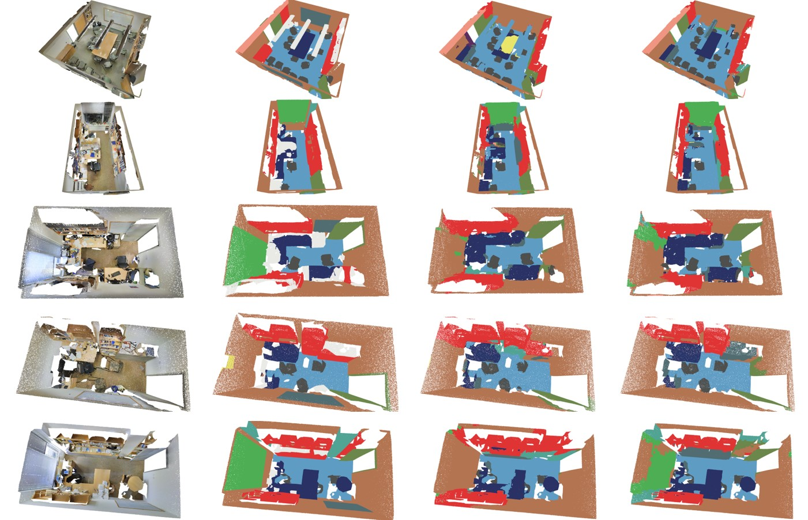

# lvwConv_csdattn



**code of Unsupervised Point Cloud Semantic Segmentation Based on 
Point Shuffle Attention**

## Setup
Setting up for this project involves installing dependencies. 

To install all the dependencies, please run the following:
```shell script
sudo apt install build-essential python3-dev libopenblas-dev
conda env create -f env.yml
conda activate growsp
pip install -U MinkowskiEngine --install-option="--blas=openblas" -v --no-deps
```

## Running codes

### Preparing the dataset
```shell script
python data_prepare/data_prepare_S3DIS.py --data_path ${your_S3DIS}
```

### Construct initial superpoints:
```shell script
python data_prepare/initialSP_prepare_S3DIS.py
```

### Training:
```shell script
CUDA_VISIBLE_DEVICES=0 python3.8 train_S3DIS.py
```

### A subset of the experimental results



**Our code builds on [GrowSP](https://github.com/vLAR-group/GrowSP/). Many thanks to GrowSP for a fantastic framework.**

